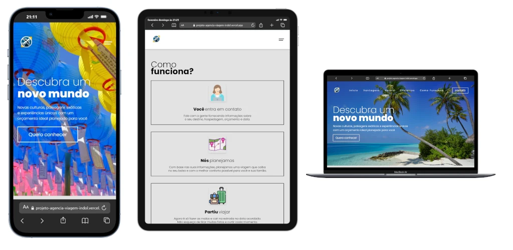

# ✈️ <span style="background-color: #F7E018; color: black; padding: 0 5px;">Projeto Travel Agency</span>

Uma landing page moderna e responsiva desenvolvida para uma agência de viagens, focada em oferecer uma experiência visual imersiva e uma navegação intuitiva para a reserva de destinos e hotéis.

[](https://projeto-agencia-viagem-indol.vercel.app/)

## 📖 Sobre o Projeto

O **Projeto Travel Agency** é uma aplicação web **Frontend** que simula a presença digital de uma agência de turismo premium. O objetivo técnico foi construir uma **Single Page Application (SPA)** estática de alta fidelidade, priorizando a **Experiência do Usuário (UX)** e a performance.

A aplicação demonstra o poder do desenvolvimento web fundamental, utilizando manipulação direta do DOM para criar interatividade dinâmica — como sliders automáticos e menus responsivos — sem a dependência de frameworks JavaScript pesados. O código é estruturado para ser modular, semântico e acessível.

## ✨ Funcionalidades Principais

- **Hero Slider Dinâmico**: Carrossel de imagens em tela cheia com transições automáticas e efeitos de _fade-in/fade-out_, gerenciado via JavaScript para manter o engajamento visual.
- **Design Totalmente Responsivo**: Layout fluido construído com _Mobile-First_, adaptando-se perfeitamente a desktops, tablets e smartphones.
- **Menu Mobile Interativo**: Navegação otimizada para telas pequenas com animação de menu "hambúrguer".
- **Header Inteligente**: O cabeçalho reage ao evento de scroll (`window.scrollY`), ajustando sua transparência e dimensões para maximizar a área visível.
- **Efeitos de Parallax**: Seções visuais com profundidade de campo que enriquecem a narrativa visual durante a rolagem.
- **Scroll Suave**: Navegação fluida entre as seções internas (Vantagens, Hotéis, Cruzeiros, Contato).

## 🛠️ Tecnologias e Métodos

O projeto utiliza a stack fundamental da web com práticas modernas de desenvolvimento:

- **HTML5 (Semântico)**: Estruturação lógica com tags como `<header>`, `<main>`, `<section>` e `<article>` para SEO e acessibilidade.
- **CSS3**:
  - **Flexbox**: Para layouts flexíveis e alinhamento de componentes.
  - **Media Queries**: Para implementação de breakpoints responsivos.
  - **CSS Variables**: Para consistência de design e fácil manutenção.
  - **Reset CSS**: Para padronização de estilos entre navegadores.
- **JavaScript (Vanilla ES6+)**:
  - Manipulação eficiente do DOM.
  - Event Listeners para interatividade.
  - Lógica de temporização (`setInterval`, `setTimeout`) para animações.
- **Assets**:
  - **Google Fonts**: Tipografia _Poppins_.
  - **Bootstrap Icons**: Ícones vetoriais leves e escaláveis.

## 🏗️ Arquitetura da API

Embora este projeto opere como uma aplicação **Frontend Estática** e não consuma uma API Backend RESTful tradicional, ele implementa uma arquitetura de dados organizada no cliente:

- **Abstração de Dados**: As imagens do slider não estão "chumbadas" no HTML. Elas são servidas através de um "banco de dados" local em `src/js/images.js`, que contém um array de URLs.
- **Separação de Responsabilidades**:
  - **Model**: `src/js/images.js` (Dados/URLs).
  - **Controller**: `src/js/imagecontrol.js` (Lógica de troca e temporização).
  - **View**: O DOM HTML atualizado dinamicamente.
- **Consumo de Recursos**: O projeto utiliza CDNs externas (Unsplash, Alpha Coders) para o carregamento de imagens de alta resolução, otimizando o armazenamento local.

## ⚡ Como Executar

Para rodar o projeto localmente em sua máquina:

1.  **Clone o repositório**:

    ```bash
    git clone https://github.com/Alexmacol/projeto-agencia-viagem.git
    ```

2.  **Acesse o diretório**:

    ```bash
    cd projeto-agencia-viagem
    ```

3.  **Execute a aplicação**:
    - Abra o arquivo `index.html` diretamente no seu navegador.
    - **Dica**: Para uma melhor experiência de desenvolvimento, utilize a extensão **Live Server** no VSCode.
